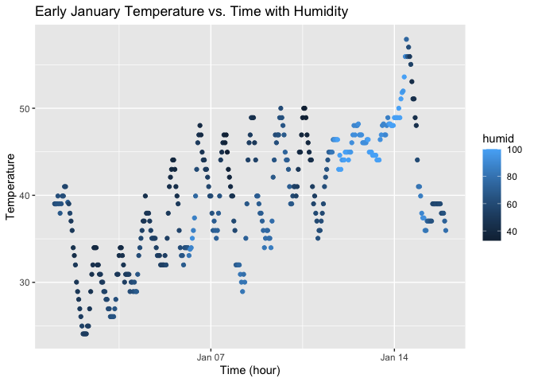

p8105_hw1_yg3099
================
daisy_gui
2025-09-21

## Problem 1

``` r
library("moderndive")
library(ggplot2)
```

``` r
data("early_january_weather") #load data
```

This dataset include the following variables: origin, year, month, day,
hour, temp, dewp, humid, wind_dir, wind_speed, wind_gust, precip,
pressure, visib, time_hour.

One of the important variables is ‘temp’, which records the temperature
at the time of record.

Another important variable is ‘time_hour’, which records the time that
the weather information are measured and recorded.

The dataset include 358 rows and 15 columns.

The mean temperature among the collected data is 39.5821229.

``` r
# create and print scatterplot
temp_time_plot = ggplot(
  early_january_weather, 
  aes(x = time_hour, y = temp, color = humid)
  ) + 
  geom_point()

print(temp_time_plot)
```

<!-- -->

``` r
# save plot to directory
ggsave(filename = "temp_time_scatterplot.png", plot = temp_time_plot)
```

    ## Saving 7 x 5 in image
